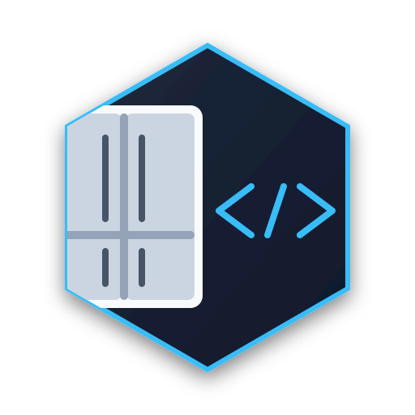
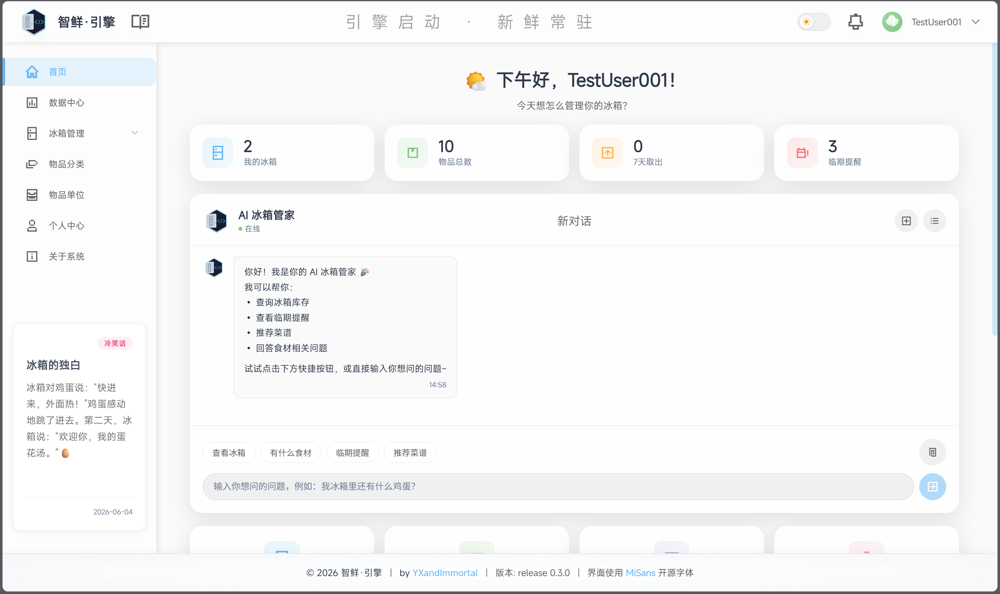
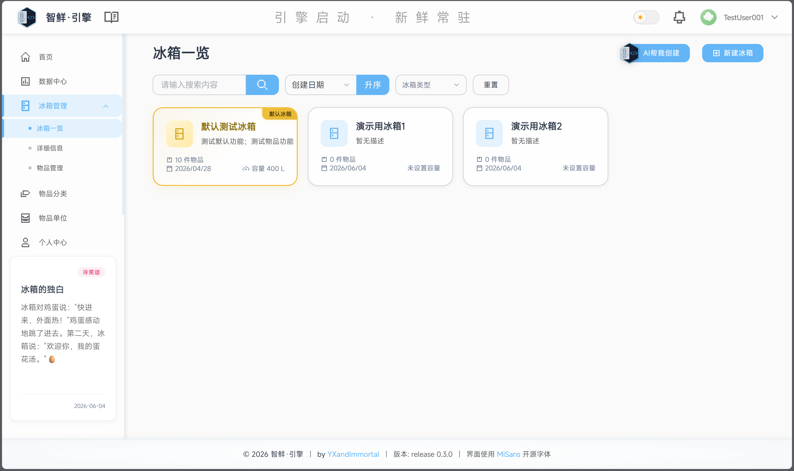
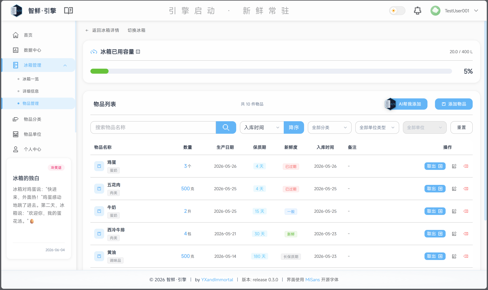
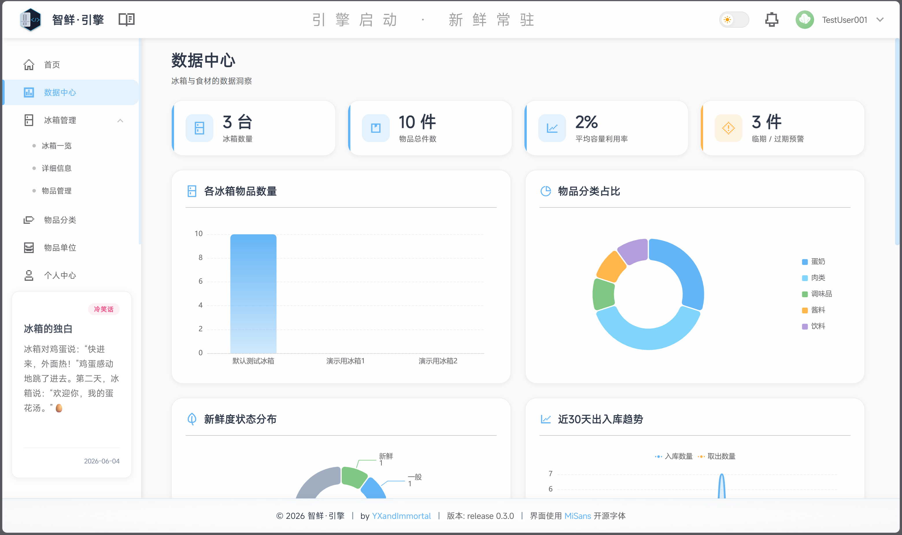
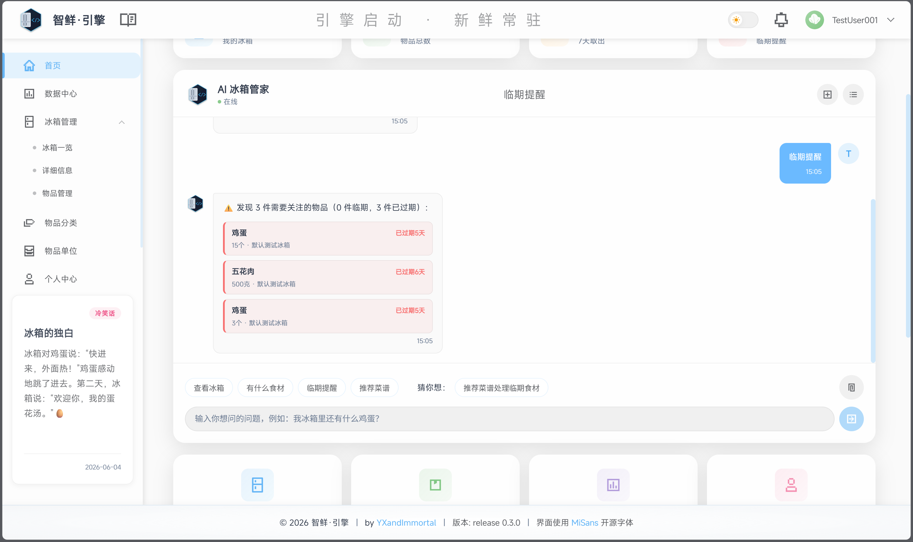
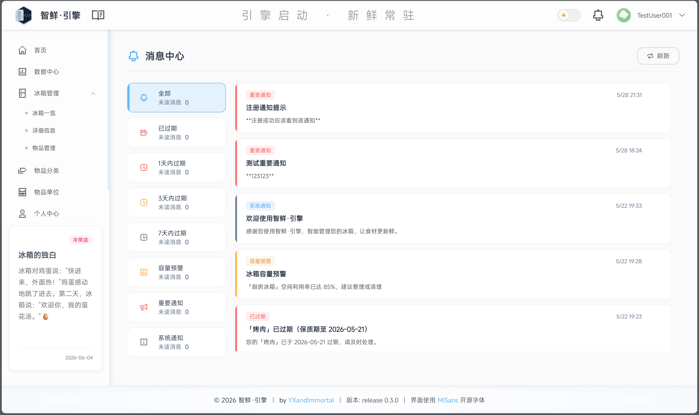
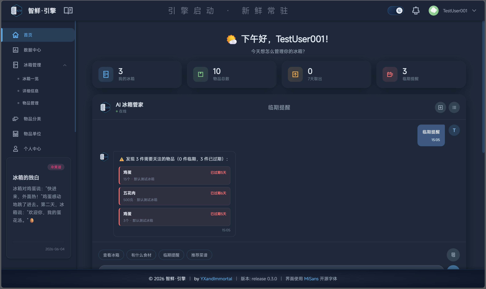

<div align="center">



# 🧊 智鲜·引擎（Fridge Butler）

> **智能管理您的冰箱，让食材更新鲜**

[](./backend/CHANGELOG.md)
[](./LICENSE)
[](mailto:yxandimmortal@qq.com)

🌐 **官方网站**：https://fridge-butler.top

</div>

---

## ⚠️ 内测公告

> **本项目目前处于内测阶段（Closed Beta），功能持续迭代中。**
>
> 部分配套文档（如详细使用手册、API 接口文档等）暂未完善，敬请谅解。文档将在后续版本中逐步补齐。
>
> 如需申请内测使用权限，请发送邮件至：**yxandimmortal@qq.com**

---

## ✨ 项目简介

**智鲜·引擎（Fridge Butler）** 是一款面向个人与家庭的智能冰箱管理 Web 应用，致力于帮助用户轻松管理冰箱食材、追踪保质期、减少食物浪费。项目深度融合了 **DeepSeek AI 大模型**，提供自然语言交互、智能推荐与自动化管家服务。

---

## 🚀 核心功能

### 📦 冰箱与物品管理
- 支持管理多台冰箱，覆盖单门、双门、三门、对开门、十字对开门、法式多门、日式多门等 **8 种常见冰箱类型**
- 食材入库、取出、变更全生命周期记录，操作可追溯
- 自定义物品分类与计量单位，灵活适配不同生活习惯

### 🤖 AI 智能管家（DeepSeek 驱动）
- **自然语言对话**：基于 SSE 流式输出，实现逐字打字机效果的实时交互体验
- **AI 冰箱创建向导**：通过聊天引导，6 步完成冰箱信息录入
- **AI 物品创建向导**：对话式添加食材，自动识别分类、保质期与单位
- **智能菜谱推荐**：根据冰箱现有食材推荐菜谱，优先使用临期食材
- **热量计算**：基于食材清单自动估算总热量与营养成分
- **容量智能估算**：AI 估算冰箱空间利用率，辅助整理决策

### 🔔 智能提醒与通知
- **临期/过期预警**：自动计算保质期，分 7 天 / 3 天 / 1 天 / 已过期多级提醒
- **容量预警**：冰箱利用率过高时自动推送通知
- **消息中心**：统一查看、筛选与管理所有系统通知

### 📊 数据中心可视化
- 冰箱容量利用率仪表盘（实时统计）
- 物品分类饼图、新鲜度分布、临期物品排行
- 取出趋势折线图、保质期柱状图、各冰箱物品数量对比

### 🌗 其他亮点
- **每日小贴士**：AI 每日自动生成冰箱冷知识、实用技巧与趣味内容
- **浅色 / 深色主题**：一键切换，全站自适应
- **新手指引（Tour）**：基于 Element Plus Tour 的分步交互式引导，覆盖全部核心页面
- **安全与权限**：基于 Spring Security + JWT 的认证授权体系，支持超级管理员后台

---

## 🛠️ 技术栈

| 层级 | 技术 |
|:---:|:---|
| **前端** | Vue 3 · Vite · Element Plus · Pinia · Vue Router · Axios · ECharts · SCSS |
| **后端** | Spring Boot 4 · Java 25 · Spring Security · Spring Data JPA · JWT |
| **AI** | DeepSeek API (deepseek-v4-pro) · SSE 流式推送 |
| **数据库** | MySQL 8 |
| **构建工具** | Maven (后端) · npm (前端) |

---

## 📁 项目结构

```
fridge-butler/
├── backend/                 # Spring Boot 后端服务
│   ├── src/main/java/       # Java 源代码
│   ├── src/main/resources/  # 配置文件、AI 提示词模板
│   └── pom.xml              # Maven 依赖管理
├── frontend/                # Vue 3 前端应用
│   ├── src/
│   │   ├── api/             # 接口请求封装
│   │   ├── components/      # 业务组件
│   │   ├── views/           # 页面视图
│   │   ├── router/          # 路由配置
│   │   ├── stores/          # Pinia 状态管理
│   │   └── styles/          # SCSS 全局样式
│   └── package.json
├── database/                # 数据库初始化脚本
│   └── fridge-butler-database.sql
└── LICENSE                  # AGPL-3.0 许可证
```

---

## 🖥️ 界面预览

| 预览 | 说明 |
|:---:|:---|
|  | **用户首页**：个性化欢迎、数据统计卡片、AI 聊天入口 |
|  | **冰箱列表**：多冰箱管理、类型图标、容量利用率展示 |
|  | **物品管理**：食材列表、新鲜度排序、取出/添加操作 |
|  | **数据中心**：多维度可视化图表 |
|  | **AI 聊天**：流式对话、结构化卡片、向导交互 |
|  | **消息中心**：临期/过期/容量预警通知 |
|  | **深色模式**：全站深色主题适配 |

---

## 🚧 开发路线图

- [x] 基础冰箱与物品管理
- [x] AI 智能对话与意图识别
- [x] AI 向导式创建（冰箱 / 物品）
- [x] 消息通知与临期提醒
- [x] 数据中心可视化
- [x] 每日小贴士
- [x] 新手指引系统
- [ ] 📄 详细使用手册（内测期间逐步完善）
- [ ] 📄 API 接口文档（内测期间逐步完善）
- [ ] 移动端响应式适配
- [ ] 更多 AI 场景（如智能采购清单）

---

## 🤝 参与内测

当前版本为 **内测版本（release 0.3.0）**，采用邀请制 / 激活码机制开放体验。

如果您对项目感兴趣，欢迎通过以下方式申请：

📧 **发送邮件至**：[yxandimmortal@qq.com](mailto:yxandimmortal@qq.com)

请在邮件中简要介绍您的使用场景，我们将在收到邮件后尽快为您开通权限。

---

## 📄 许可证

本项目采用 [GNU Affero General Public License v3.0 (AGPL-3.0)](./LICENSE) 开源许可证。

> 根据 AGPL-3.0 的要求，如果您将本项目的修改版本部署在可供公众访问的服务器上，您需要向该服务器的用户提供您修改后的源代码。

---

## 🙏 致谢

- [DeepSeek](https://deepseek.com/) — 提供 AI 大模型能力支持
- [Element Plus](https://element-plus.org/) — 优秀的 Vue 3 组件库
- [Spring Boot](https://spring.io/projects/spring-boot) — 强大的 Java 后端框架

---

<div align="center">

**Made with ❄️ by [YXandImmortal](https://github.com/YXandImmortal)**

</div>
